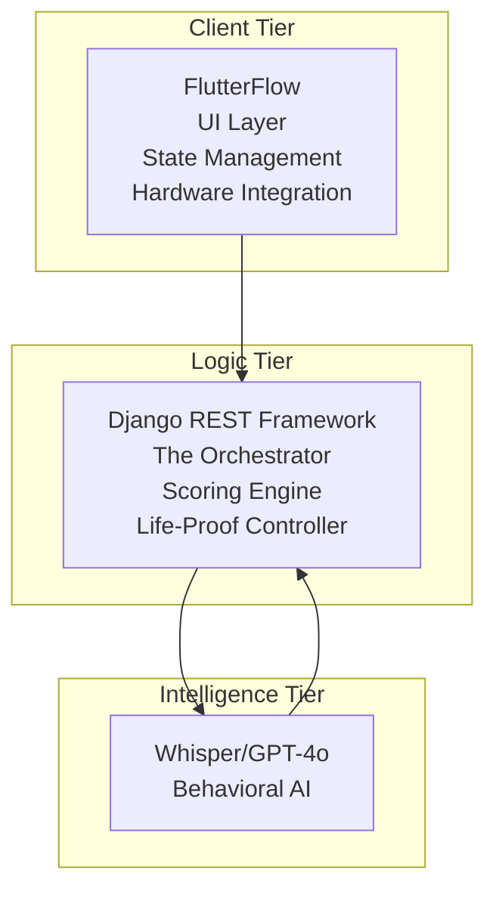
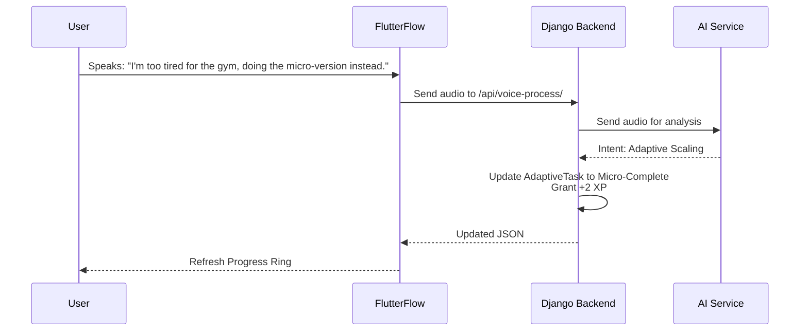

This document defines how the different technologies (Django, FlutterFlow, and AI) will communicate. Because you want "all 3" for every feature, the architecture must be **event-driven**—meaning the backend is constantly watching your behavior and reacting.

---

# System Architecture: SentinL (The Discipline OS)

## 1. High-Level Architecture

SentinL follows a **Client-Server Architecture** using the **Hub-and-Spoke model**. The Django Backend acts as the "Central Hub" (The Brain), while FlutterFlow and AI Services act as the "Spokes."

---

## 2. Component Breakdown

### A. The Client Tier (Frontend - FlutterFlow)

* **UI Layer:** Handles the "Dopamine Rewards" (animations) and the "Avatar" rendering.
* **State Management:** Tracks if the user is in "Lazy Mode" or "Standard Mode" locally before syncing with the server.
* **Hardware Integration:** Accesses the microphone for **Voice-to-Action** and local notifications for **The Enforcer**.

### B. The Logic Tier (Backend - Django REST Framework)

* **The Orchestrator:** Processes incoming voice/text and decides which "Personality" (Analyst, Guardian, or Enforcer) should respond.
* **Scoring Engine:** A custom Python service that calculates the  using a weighted decay formula.
* **The "Life-Proof" Controller:** Manages the logic for Sickness Mode, Streak Freezes, and Adaptive Scaling.

### C. The Intelligence Tier (External APIs)

* **Whisper/GPT-4o:** Converts your voice commands into structured data (e.g., "I'm doing my pushups" → `update_task(id=5, status='complete')`).
* **Behavioral AI:** Analyzes your "Failure Reasons" to suggest better routines for the following week.

---

## 3. Data Flow Diagram (The Discipline Loop)

1. **Input:** User speaks into the FlutterFlow app: *"I'm too tired for the gym, doing the micro-version instead."*
2. **Processing:** FlutterFlow sends the audio to the **Django `/api/voice-process/**` endpoint.
3. **Analysis:** Django sends audio to the AI → AI identifies the intent as **"Adaptive Scaling"**.
4. **Execution:** * Django updates the `AdaptiveTask` to "Micro-Complete."
* The `DisciplineProfile` grants +2 XP instead of +10 XP.
* The `Avatar` health stays steady but doesn't grow.

5. **Response:** Django sends updated JSON back to FlutterFlow to refresh the "Progress Ring."

---

## 4. Technical Stack Summary

| Component | Technology |
| --- | --- |
| **Language** | Python 3.12+ (Backend), Dart (Frontend) |
| **Framework** | Django 5.0 + Django REST Framework |
| **Database** | PostgreSQL (Production) / SQLite (Development) |
| **Deployment** | Ngrok (for testing), Heroku/AWS (for production) |
| **AI Processing** | OpenAI API / Gemini Pro |

---
## 5. Security & Compliance
* **Authentication:** JWT Tokens for secure API access.
* **Data Privacy:** All personal data is encrypted at rest and in transit (TLS 1.2+).
* **Compliance:** GDPR-compliant data handling practices.
---
## 6. Future Scalability
* **Microservices:** Future decomposition of the Scoring Engine into a separate microservice for independent scaling.
* **Load Balancing:** Implementation of load balancers (e.g., AWS ELB) to manage high traffic during peak usage times.
* **AI Model Updates:** Modular AI integration to easily swap or upgrade AI models as technology evolves.
---
