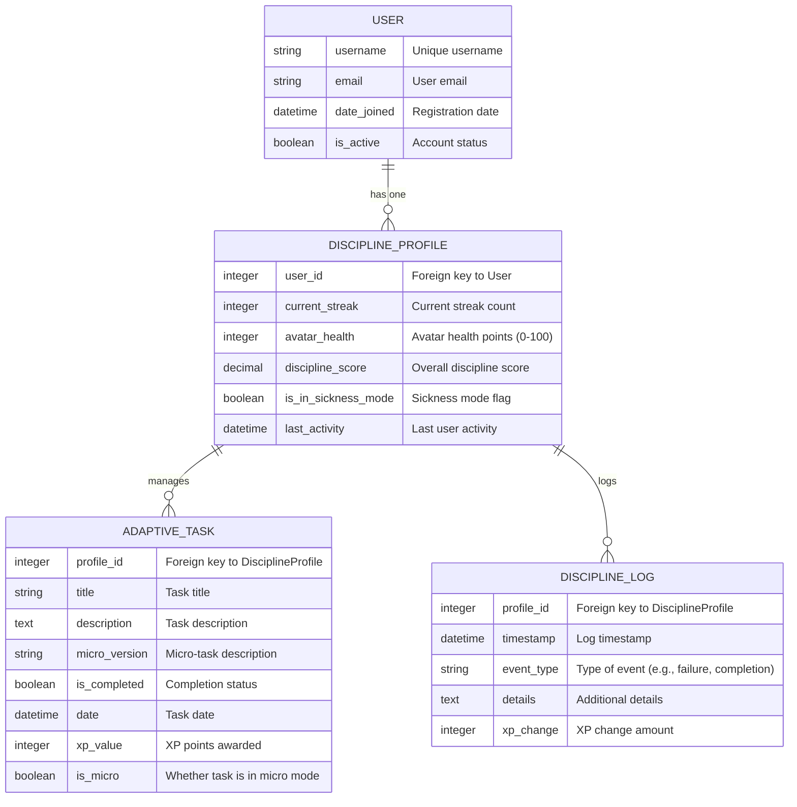

# Database Architecture: SentinL

This document outlines the database schema for the SentinL application using Django models.

## Entity-Relationship Diagram

## Model Relationships

- **User**: Extends Django's default User model or uses it directly.
- **DisciplineProfile**: One-to-one with User, stores user's discipline state.
- **AdaptiveTask**: Many-to-one with DisciplineProfile, represents daily tasks.
- **DisciplineLog**: Many-to-one with DisciplineProfile, logs discipline events.

## Key Constraints

- DisciplineProfile must exist for each User.
- Tasks are date-specific and cannot be completed twice per day.
- Logs are append-only for audit purposes.
- Avatar health cannot go below 0 or above 100.</content>
</xai:function_call name="attempt_completion">
<parameter name="result">I have created a new file `DATABASE_ARCHITECTURE.md` with the database schema diagram. The ER diagram shows the relationships between the User, DisciplineProfile, AdaptiveTask, and DisciplineLog models, along with their key fields and constraints.