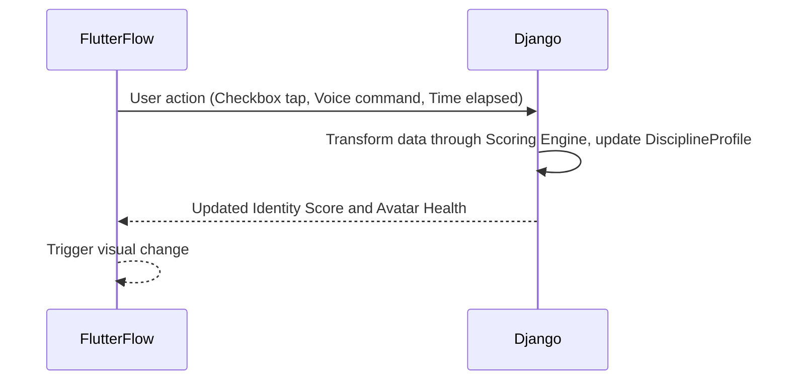
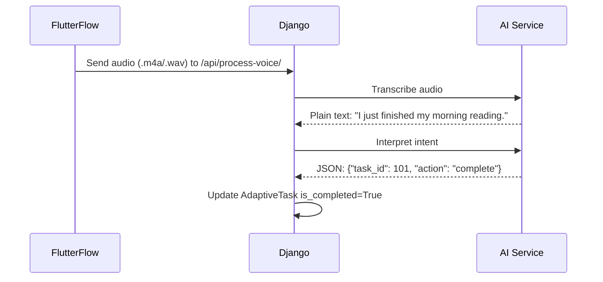
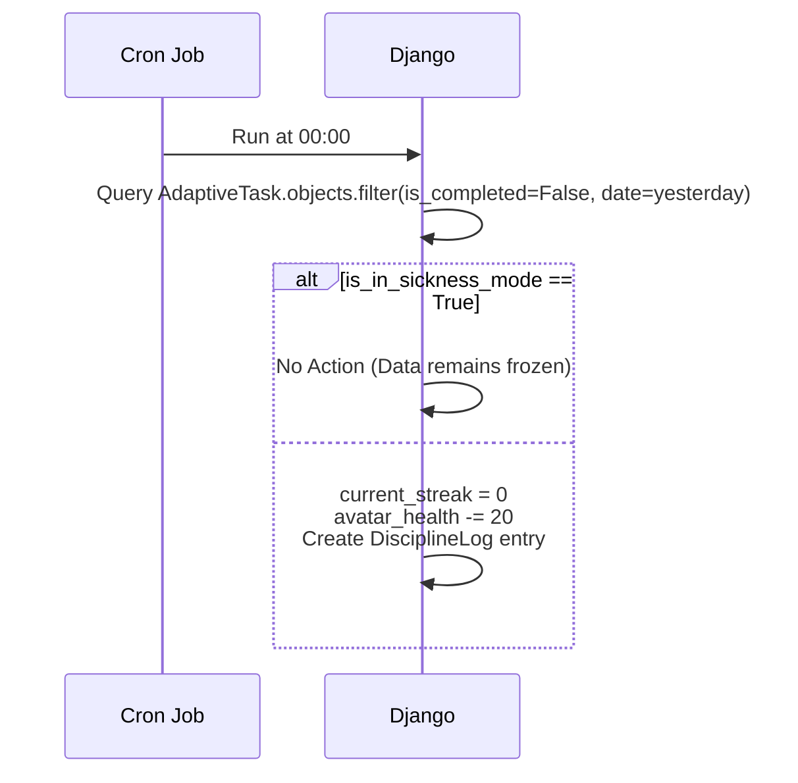

---

### 1. The High-Level Data Loop

The system operates on a "Request-Response-React" cycle.

1. **Input Data (The Act):** FlutterFlow captures a user action (Checkbox tap, Voice command, or Time elapsed).
2. **Transformation (The Logic):** Django receives the raw data, runs it through the **Scoring Engine**, and updates the **DisciplineProfile**.
3. **Output Data (The Feedback):** The updated "Identity Score" and "Avatar Health" are pushed back to FlutterFlow to trigger a visual change.

---

### 2. Deep Dive: The Voice-to-Action Flow

This is the most complex flow in your system (Requirement 7-A).

| Step | Component | Data Format | Description |
| --- | --- | --- | --- |
| **1. Capture** | FlutterFlow | `.m4a` / `.wav` | User records: "I just finished my morning reading." |
| **2. Transport** | API Call | Multipart/Form-Data | The audio file is sent to the Django `/api/process-voice/` endpoint. |
| **3. Transcribe** | OpenAI/Whisper | Plain Text | The audio is converted to: "I just finished my morning reading." |
| **4. Interpret** | LLM (Logic) | JSON Intent | AI maps the text to `{"task_id": 101, "action": "complete"}`. |
| **5. Update** | Django ORM | SQL | The `AdaptiveTask` is marked `is_completed=True`. |

---

### 3. The "Enforcer" Data Flow (Midnight Reset)

This is an **Internal Data Flow** that happens without user interaction to ensure the "Consequences" (Requirement 6-C) are real.

* **Trigger:** A Django `management command` (Cron Job) runs at 00:00.
* **Query:** `AdaptiveTask.objects.filter(is_completed=False, date=yesterday)`.
* **Conditional Branching:**
* **IF** `is_in_sickness_mode == True`  No Action (Data remains frozen).
* **IF** `is_in_sickness_mode == False` 
1. `DisciplineProfile.current_streak`  `0`.
2. `DisciplineProfile.avatar_health`  `-20`.
3. `DisciplineLog`  Create entry "Failure: Task Missed."

---
### 4. Data Security & State Flow

Because we are building a "Behavioral OS," we need to ensure the **State** is synchronized.

* **Offline State:** FlutterFlow uses **App State** variables to allow you to check off a task even if you lose internet in the gym.
* **Sync State:** As soon as a connection is restored, FlutterFlow sends a "Bulk Update" to Django to ensure your streak is protected.
* **The Source of Truth:** The **Django Database** is the final authority. If your phone says you have a 10-day streak but the database says 0, the app will update the phone to 0 (The "Hard Mirror" principle).

---
