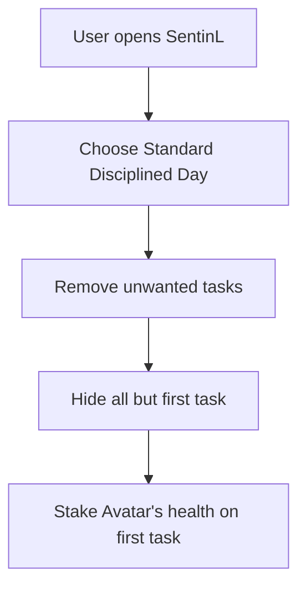
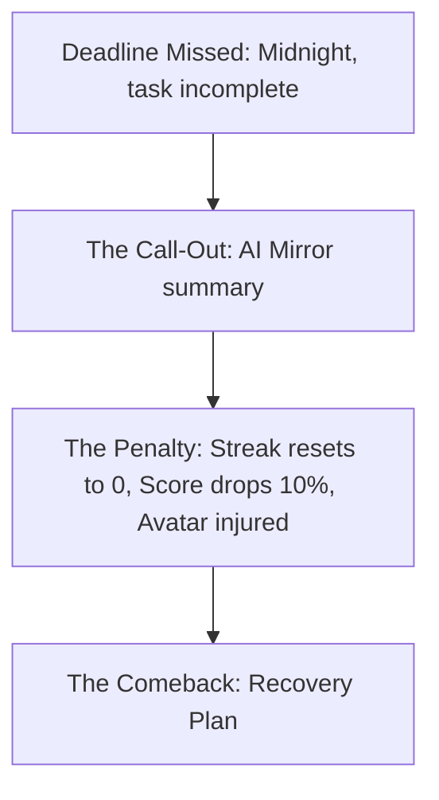

---

### Phase 1: The "Onboarding" Flow (Identity Creation)

This flow handles how you go from being undisciplined to having your first "contract" with the app.

1. **Entry:** User opens SentinL.
2. **Template Selection:** User chooses a "Standard Disciplined Day" (Requirement A).
3. **The Trim:** User removes tasks they don't want (Requirement B).
4. **The Lock:** The app hides all but the **first** task (Requirement C - Incremental Unlocking).
5. **Commitment:** User "stakes" their Avatar’s health on this first task.



---

### Phase 2: The "Daily Action" Flow (The Loop)

This is the core interaction you will have every day using the Voice and AI features.

1. **Morning Trigger:** SentinL sends a "Cold Coach" notification.
2. **Input (Voice/Chat):** User speaks: *"Starting my morning deep work."* (Requirement 7-A).
3. **Real-Time Update:** The Django backend marks the task as "In Progress."
4. **Completion:** User taps the NFC tag on their desk or tells the AI "Done."
5. **The Reward:** FlutterFlow triggers a "Dopamine Pop" animation; the Progress Ring fills up; the Avatar gains XP.

```mermaid
flowchart TD
    A[Morning Trigger: Cold Coach notification] --> B[User speaks: "Starting my morning deep work."]
    B --> C[Real-Time Update: Mark task as In Progress]
    C --> D[Completion: Tap NFC or tell AI "Done"]
    D --> E[The Reward: Dopamine Pop, Progress Ring fills, Avatar gains XP]
```

---

### Phase 3: The "Resistance" Flow (Adaptive Scaling)

This is what happens when you feel lazy or "undisciplined" (Requirement 8-B).

1. **The Slump:** User sees a "Gym" task but feels exhausted.
2. **Negotiation:** User tells the AI Chat: *"I can't do the gym today."*
3. **The Pivot:** The AI offers the **Micro-Version**: *"Understood. Do 10 minutes of stretching instead to keep the streak alive?"*
4. **Decision:** * **User Accepts:** Task scales down. Streak is saved. Half-points awarded.
* **User Rejects:** The "Enforcer" logic kicks in.

```mermaid
flowchart TD
    A[The Slump: Sees Gym task, feels exhausted] --> B[Negotiation: Tell AI "I can't do the gym today."]
    B --> C[The Pivot: AI offers Micro-Version]
    C --> D{User Accepts?}
    D -->|Yes| E[Task scales down, Streak saved, Half-points awarded]
    D -->|No| F[The Enforcer logic kicks in]
```

---

### Phase 4: The "Enforcer" Flow (Consequences)

This is the psychological "Hard Stop" (Requirement 6-C).

1. **Deadline Missed:** It’s midnight. A task is still "Incomplete."
2. **The Call-Out:** The "AI Mirror" sends a summary: *"You spent 3 hours on Instagram but missed your 10-minute stretch."*
3. **The Penalty:** * Streak resets to **0**.
* Discipline Score drops by **10%**.
* The Avatar appears "Injured/Sick" in the UI.


4. **The Comeback:** The app presents a "Recovery Plan" to earn back the lost points tomorrow.



---

### Phase 5: The "Emergency" Flow (Life-Proofing)

1. **Trigger:** User tells the app: *"I'm sick"* or *"Emergency."*
2. **Verification:** AI asks for a quick duration (e.g., "How many days?").
3. **Freeze:** Django sets `is_in_sickness_mode = True`.
4. **Safety:** All penalties are paused. The Avatar goes to "Sleep" until the user returns.

```mermaid
flowchart TD
    A[Trigger: Tell app "I'm sick" or "Emergency"] --> B[Verification: AI asks for duration]
    B --> C[Freeze: Set is_in_sickness_mode = True]
    C --> D[Safety: Penalties paused, Avatar sleeps]
```

---
